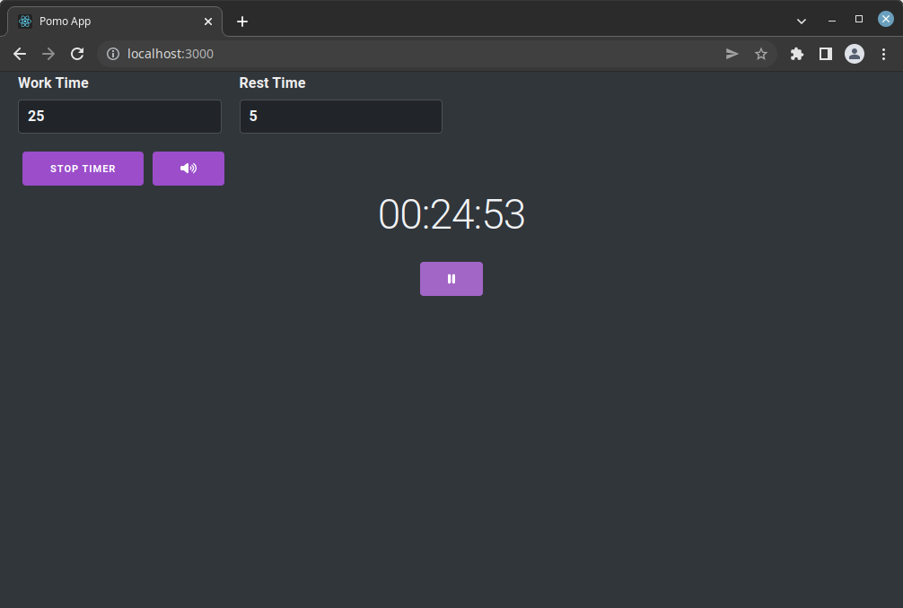

# Pomo - A simple Pomodoro Timer in React

This is my first attempt at learning React. This is meant to be a simple 
Pomodoro timer and was created with the 'create-react-app' command. The 
Pomodoro Technique is a time management method developed by Francesco Cirillo 
in the late 1980s.[1] It uses a kitchen timer to break work into ntervals, 
typically 25 minutes in length, separated by short breaks. This app lets you 
configure the length of the work interval, the length of the rest interval, 
and whether or not to play a sound at the end of an interval. I am not a web 
designer or developer so the interface and code needs work.

**Getting Started**

Get a copy of the source code via git

    git clone https://github.com/spcnvdr/pomo

Change into the project directory

    cd pomo

Install the NPM dependencies

    npm i

Start the server

    npm start

Now navigate to http://localhost:3000/ to use the app!

**Screenshot**

**Contributing**

Pull requests, new feature suggestions, and bug reports/issues are
welcome.

**License**

This project is licensed under the 3-Clause BSD License also known as the
*"New BSD License"* or the *"Modified BSD License"*. A copy of the license
can be found in the LICENSE file. A copy can also be found at the
[Open Source Institute](https://opensource.org/licenses/BSD-3-Clause)

